# Neural Network Charity Analysis

## Overview
In this analysis, we will create a binary classifier to predict whether applicants to Alphabet Soup's charity program will be successful if they are funded. 

We will work with a dataset containing metadata for over 34,000 organizations who have received funding from Alphabet Soup in the past. 

We will first preprocess the data for a neural network model, then compile, train and evaluate the model and finally optimize the model to try and achieve a predictive accuracy of 75% or higher.

## Results
1. Data Preprocessing
    - What variable(s) are considered the target(s) for your model?
        - IS_SUCCESSFUL is the target variable (y) for the model as we are trying to determine if an applicant will be successful if they receive funding from Alphabet Soup.

            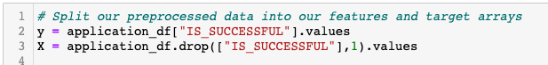 
    
    - What variable(s) are considered to be the features for your model?
        - Features (X) for the model are all columns from the merged one-hot encoded features dataframe *application_df* minus the IS_SUCCESSFUL column.

            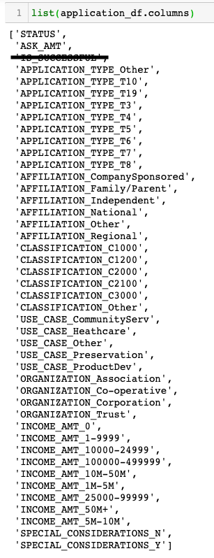
    
    - What variable(s) are neither targets nor features, and should be removed from the input data? 
        - EIN, NAME are neither targets nor features so we dropped these columns during preprocessing.

            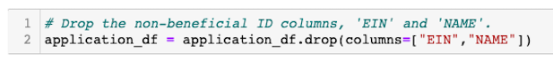

2. Compiling, Training, and Evaluating the Model
    - How many neurons, layers, and activation functions did you select for your neural network model, and why?
        - We used 2 hidden layers at 80 and 30 neurons with activation function *relu* for the layers and *sigmoid* for the output layer. 

            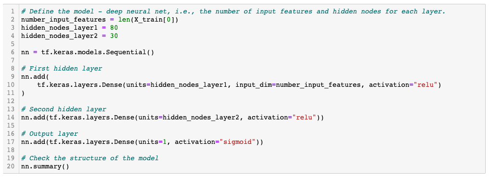

    - Were you able to achieve the target model performance?
        - No, we achieved a model accuracy of 72.52%.

            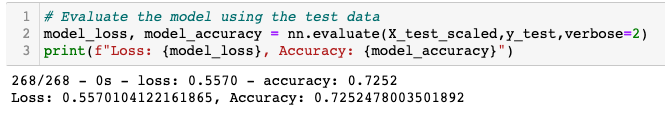

    - What steps did you take to try and increase model performance?
        1) We made three attempts to increase the model to over 75% accuracy. For the first attempt, we updated the following:
            - Dropped some additional noisy variables.

                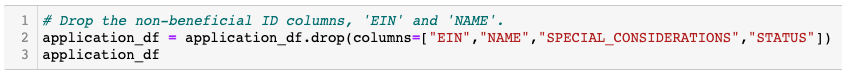

            - Added additional neurons to the hidden layers, added another hidden layer and updated the activation functions for the hidden layers and output layer.

                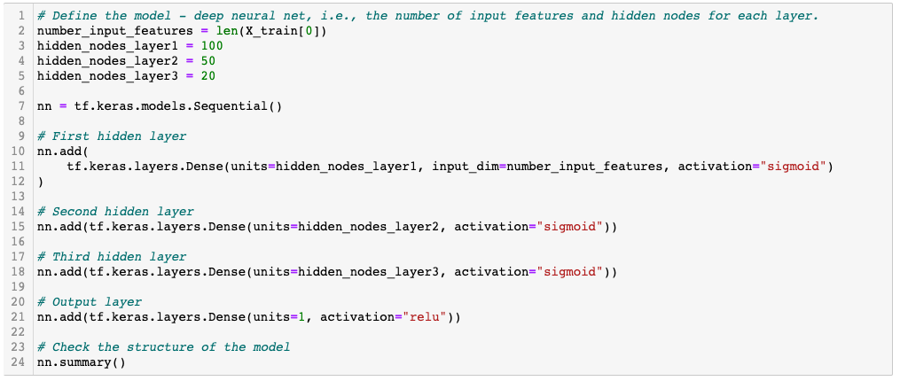

            - **Result:** Accuracy actually decreased slightly to 72.47%.

                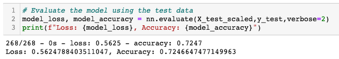
        
        2) For the second attempt, we updated the following:
            - Increased the number of values for the application bin to 800.

                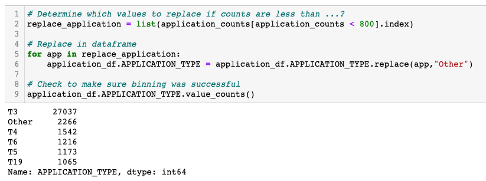

            - Decreased the neurons for the hidden layers from the first attempt, kept the added hidden layer and updated the activation functions for all the hidden layers and output layer to *sigmoid*.

                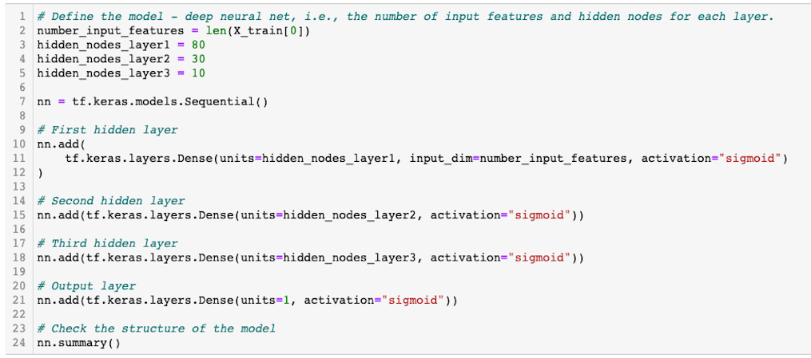

            - **Result:** Accuracy increase slightly (72.62%) but not past the 75% target.

                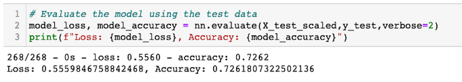

        3) For the final attempt, we updated the following:
            - Dropped the noisy variables again as we did in Attempt 1.

                
            
            - Kept the increased number of values for the application bin that we updated during the second attempt.

                

            - Dropped the added hidden layer going back to the original 2 hidden layers.  Increased the neurons for the 2 hidden layers and kept the activation functions at *sigmoid*.

                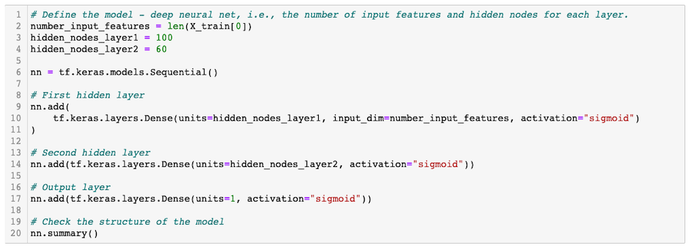

            - **Result:** Accuracy increased from the previous attempt slightly (72.66%) but still was unable to get to above 75% accuracy rate.

                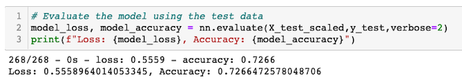

## Summary

In summary, the results of the 4 models we ran did not achieve the goal of getting the predictive accuracy to over 75%.  

Since this project is a binary classification problem, I would recommend trying the SVM model. SVMs have advantages over neural network/deep learning models when it comes to binary as SVMs excel at classifying and creating regression using two groups.  Additionally, SVMs are less likely to overfitting as it looks at maximizing the distance not working with all data within the boundry. 

I would also recommend trying Random Forest model as the dataset we are using is tabular and also solves the binary problem.  Random Forest is a much simpler model and complex models like deep learning are not always the better model to achieve predictive accuracy.